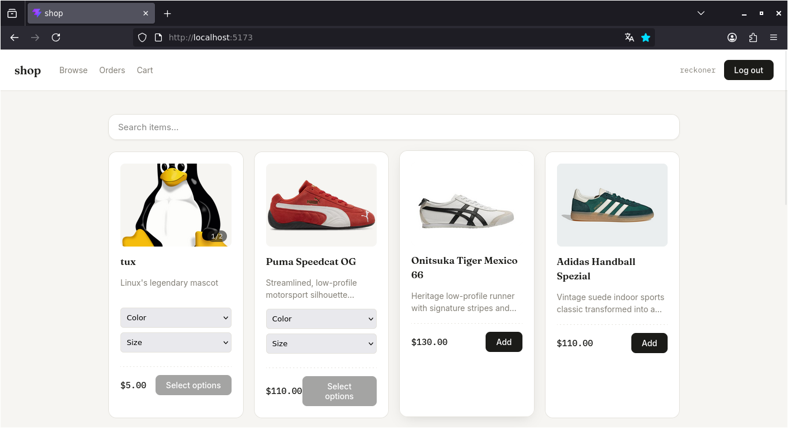
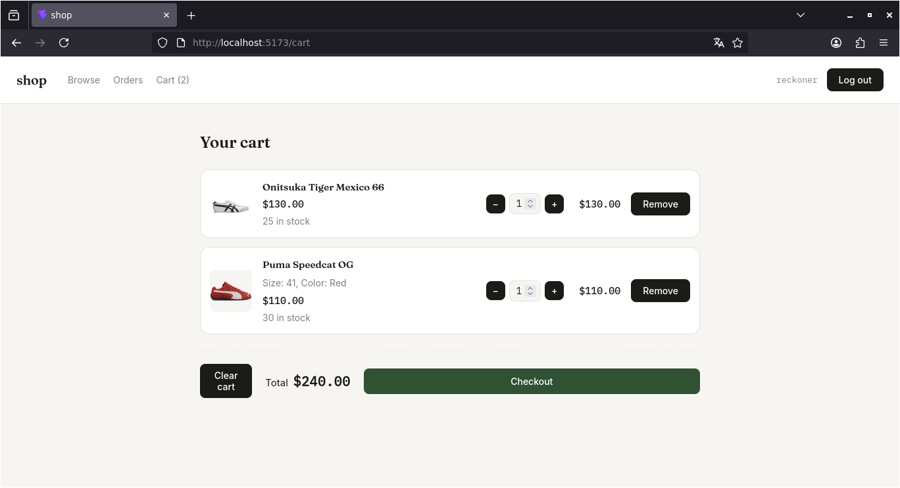
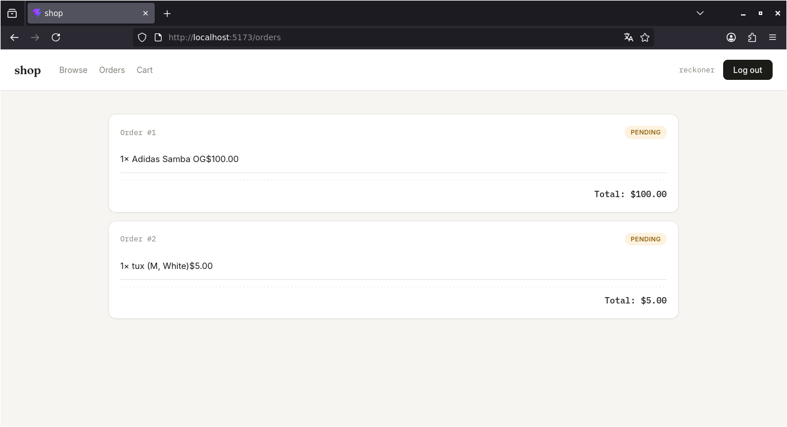
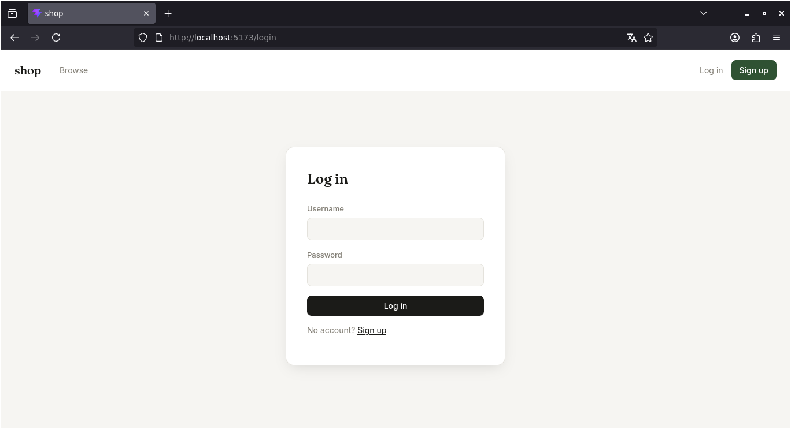
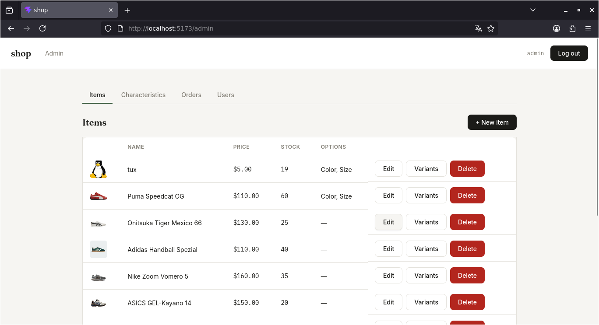
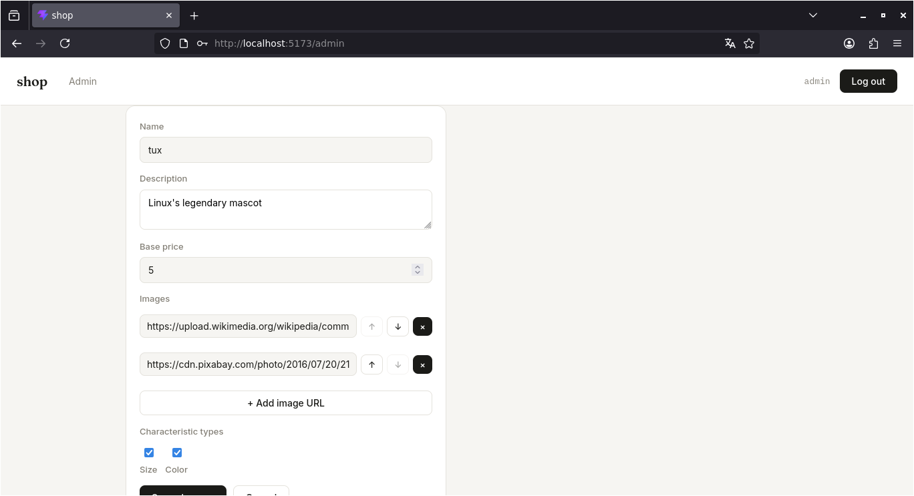
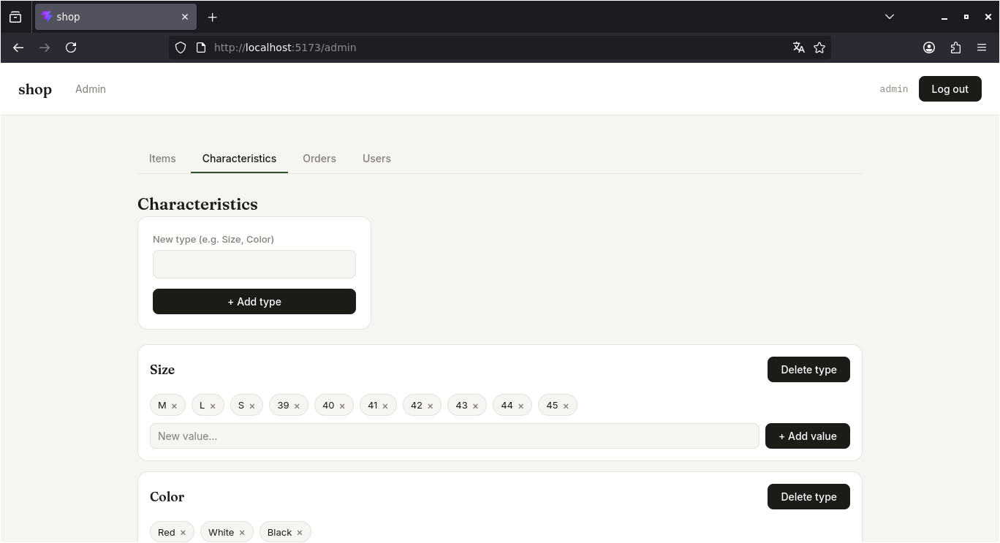

# Shop

A full-stack e-commerce demo application built with Spring Boot and React.

## Screenshots
### User side 

 

 

 

### Admin panel 

 

Tech Stack

Backend

* Java 21
* Spring Boot
* Spring Security + JWT
* PostgreSQL
* Flyway
* Maven

Frontend

* React
* Vite

Infrastructure

* Docker Compose

Features

* User registration and JWT authentication
* Role-based access control (USER / ADMIN)
* Product management
* Product variants with characteristics
* Multiple product images
* Persistent shopping cart
* Order creation and order history
* Inventory management
* PostgreSQL migrations with Flyway
* Docker Compose setup

Running with Docker

Create a .env file with the required environment variables, then run:

docker compose up --build

The application will be available at:

* Frontend: http://localhost:5173
* Backend API: http://localhost:8080/api

Project Structure

demo-shop/
├── shop-backend/     # Spring Boot REST API
├── shop-frontend/    # React frontend
└── docker-compose.yml

API

The backend provides REST endpoints for:

* Authentication
* Users
* Items and variants
* Characteristics
* Cart
* Orders

Authentication is handled with JWT, while admin-only operations are protected with Spring Security roles.
